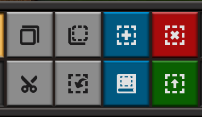

# 蓝图与建设机器人

*蓝图功能使得这个游戏从“肝帝的游戏”转变为“休闲佛系游戏”。*

熟练使用蓝图是这个游戏中后期很关键的技能，特别是解锁建设机器人后，很多建设、改拆工厂的工作都可以交给建设机器人来完成。
其UI在下方工具栏的右侧。除了蓝图，剪切(`Ctrl`+`X`)、复制(`Ctrl`+`C`)和粘贴(`Ctrl`+`V`)也是很方便的功能，适合批量调整工厂布局。
可以说，到了这个阶段，游戏才正式开始。
绿图用于批量的升级，如传送带、组装机和石炉的升级，红图用于批量的拆除。

按`B`键打开蓝图本，可以查看自己和地图内其他玩家的蓝图。
蓝图也可以通过**蓝图代码**分享给他人，点击UI处导入代码按钮，粘贴蓝图代码，稍等片刻，就可以获取到他人分享的蓝图。
本指南从此开始也会附带一些蓝图代码，一般在图片预览的下方，可以点击复制代码按钮复制到剪切板内。

## 如何分享和获取蓝图？

- **FactorioBin**： 推荐在 [factoriobin](https://factoriobin.com/) 上分享蓝图代码，
factoriobin 本身并没有蓝图搜索的功能，但是你可以在 [searchfactoriobin](https://searchfactoriobin.com/) 搜索factoriobin上他人分享的蓝图。
例如，需要一些传送带均分器的蓝图，可以以关键词 "balancer" 进行搜索。
- **玩家社区**： 如百度贴吧，异星工厂的QQ群。
