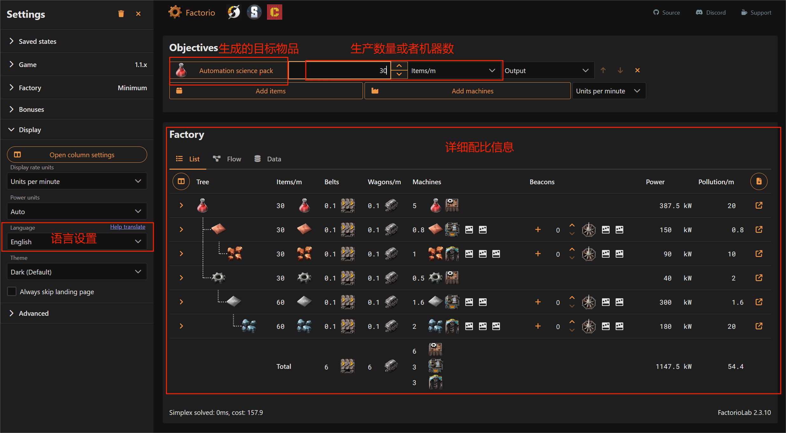
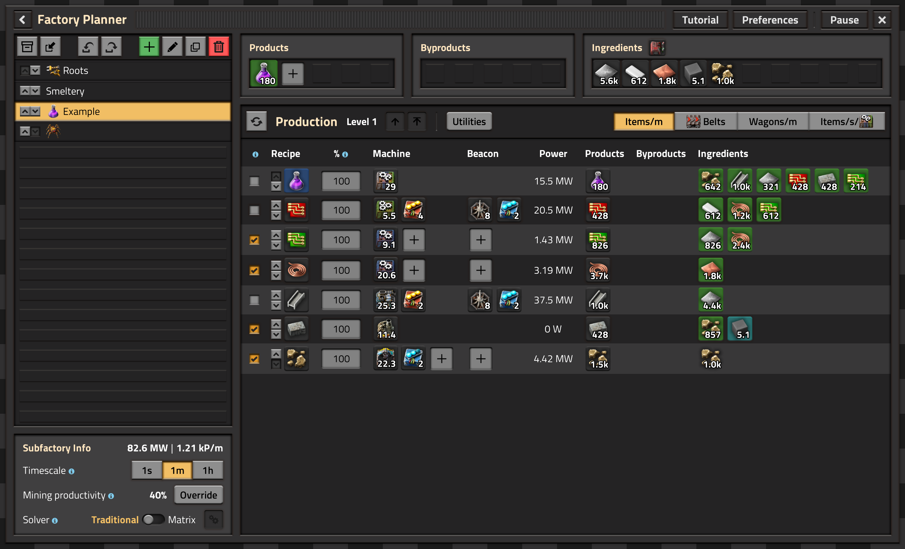
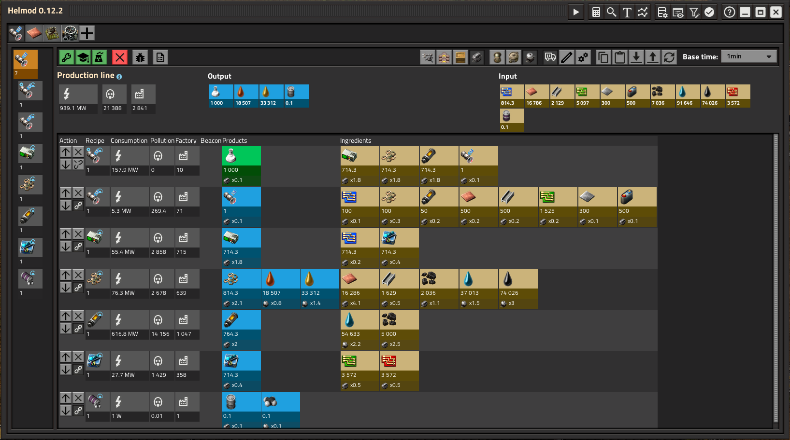
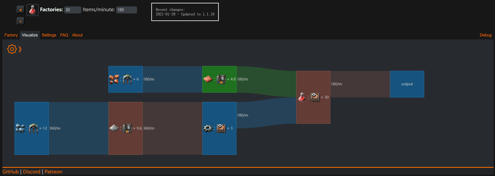

# factorio 量化工厂计算器

| 计算器                                                                | 描述                           | 屏幕截图                                |
| --------------------------------------------------------------------- | ------------------------------ | --------------------------------------- |
| [**factoriolab**](https://factoriolab.github.io/list?v=9)             | **推荐**                       |   |
| [Factory Planner (Mod)](https://mods.factorio.com/mod/factoryplanner) | 游戏内Mod                      |  |
| [Helmod](https://mods.factorio.com/mod/helmod)                        | 游戏内Mod                      |           |
| [kirkmcdonald's Calculator](https://kirkmcdonald.github.io/calc.html) | 很久没更新，最近的版本是1.1.19 |     |

## Factoriolab

比较推荐的计算器是 [factoriolab](https://factoriolab.github.io/list?v=9)，支持中文，功能也比较全面。

