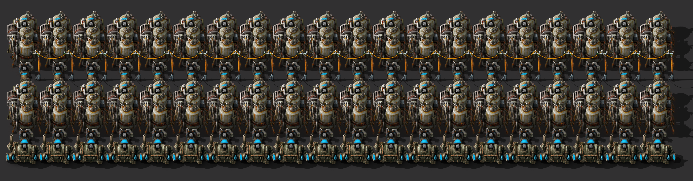
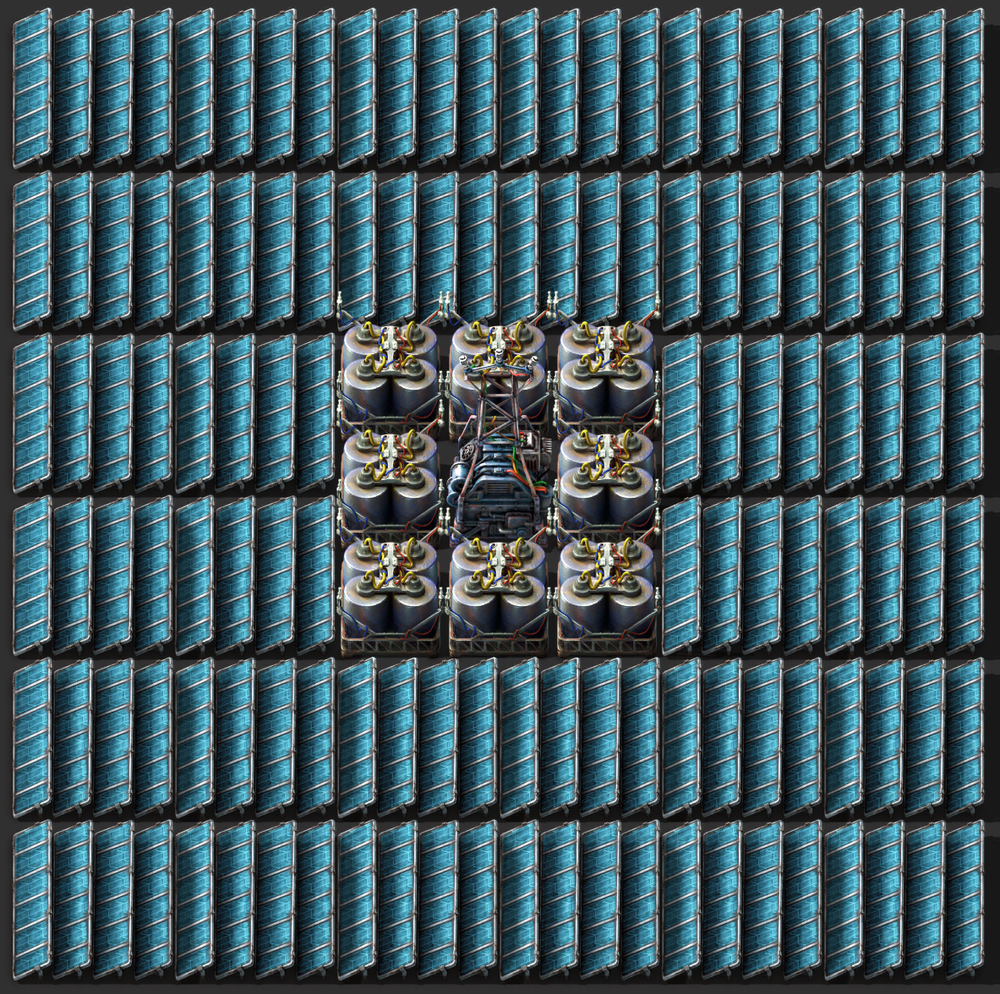
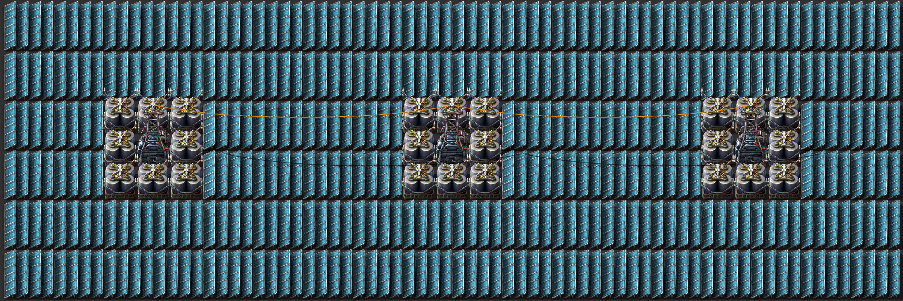

# 电力

## 热能

一台抽水机是 1200/s，每台锅炉消耗水 60/s并产生蒸汽60/s，每台蒸汽发电机消耗蒸汽60/s。
所以，一台抽水机可以带 20 台锅炉，每台锅炉可以带两台蒸汽发电机。
以下是两种常用布局：

<center></center>

```
0eNqdmk2O4zYQha8SaC0PWPyngTlC1lkMGoHdI3QEyLIhq4M0Gl7kDrlF1jnTXCOyB2kZExZZz7u2of5cfsVXpIv13uyH1+409ePcbN+b/vk4npvtl/fm3L+Mu+H63vx26ppt08/doWmbcXe4vjrP3e6w6caXfuyaS9v049fuj2ZLl6e26ca5n/vuO+f24u3X8fWw76blgTyhbU7H8/JPx/H6iQtoo9Mn1zZvzVabT+5yaf9H0mKSr5CMmGQqJCsmqQrJSUkUKiQvJtkKKYhJVCFFKSlWQEkKchUQKXHqaqQHlnhiUHdr/LAbhk03dM/z1D9vTschS/zQa1nziyvHrn/5bX98na5epNAa/5T7mNUAp/5UjtQzkdoqwtcQDjc0p5vHHc2hApoCXUqBbrXOpiBW9TM1/VIVoSoIrfD6xeimCS9gHAp1AfmyC3TIpUBXXbBGyulXdcFaYzmEw8s1p5vH6zWHQl1AqpCCJaEm6wJddcEaKadf1QWxQjAK3pwY1QzBuxNHQi1gS/Jnl7+pLn9XE66+B9QIDt6EOcE8KJj5b2Fd/8iU7eiyoq2+2B/7YXmrsHcak400ChC+jEgChCkirBIgVBlBdcRHBWUQWoCwZYQRIKiMsHVELBNcneDKBC/IR5mwLs152o3n03GaN/tumEvHRuNui/9rPy1uuT3gc+h1yfbjuZvmfHgfUPsj1OagCYjXQ/E6BaADhiaRFAGSwmkgXovFawC0w9AWQGsM7QC0wdBelECNJRDxnsLijQCaMHQSSUGQFB7wHmFlyBOAThgacCBhxcgDDiSsGHkrSeAaryyBgPcIK0beA2isGPkgksJhUgDeI6zCeWD3I6zCBcSBWDEKiAOxYhS0KIEKSmAAvIfVogBsflgpCk4iRMJ0AIyHVbcA7HxYcQuA+bAyFADvYVUoKknuLJS7CHgOKxRRZDmDRWuQH8hRALTYbw+m0xAd2tb198Qf+gPGt0m1pGKuRxA99hOBizggfQKJkhHpGkiACTtKM180KTQ1qpCaJdEp27pJhJ12uWg10jgRqJgM0kaRAMFTIfdFUcesh8FMWm52Udm8eOzkxoUbkFaSRMaINJYkwISdcLhrH4X6JZby4pa8ZP1CiqCDCBuuBrprAhlJGaDZJgJaaNdmvyi8xRTywpiFlIf2bDbWALQbRRrGh/vvKVvESTMCJPi23RJ3ca/gG2ieRfAVNM/S8LUszzLwvSzPsvBdJc9y8GUlz/LoDR6PCugVHo+K6OUWj3pg0QduxEQ9OmNiba5OxcWq+SmTu5GA2pjJDZ1laPGcCc8wuM1Z9Sxuc5blxDMg/HdD7z0/DrjZbC6Lg0y+8N6NBNTGTfhoI17YWPUSXtg4llGPTpzkVfSLivlDlSHx0AmrotHiqROeYfBSzqpn8VLOstyjgyfZTCyJJZtfz3cTA7XZE17FIB0+4RHwaCSvHTwcyaKsenD+JJ+FvBcsSSdQWPWslo6g8AgDb9M31Z7a7xPS27uB6rYZdvtuWN779uff3/76x/iff/npy/Wxz/fsp+XB37vpfGPrSDYkHXzSKhp9ufwLDtmLJg==
```

<center></center>

```
0eNqdmU1u2zAQRu/CNV1oOKQk+ipFUNipkAqQZcNWigSBz1C06EW6KNBNj9OfY5ROFnVRkt+QO9tJ3nAGH/WC8ZPaTvfD4TjOi1o/qfF2P5/U+vWTOo1382a6fLY8Hga1VuMy7JRW82Z3eXdahs1uNcx34zyos1bj/HZ4UGs632g1zMu4jMML5/nN45v5frcdjuEX4gStDvtT+KP9fKkYQKu2e+W0egyvyIaX57P+j2XELAtZLGYRZFkpy/WQ5cQsB1mtmGUgq5OyrIesXsxqIcuLWQxZ1IhhDYaJk884+SSOPuPokzj7jLNP4vAbHH4Sp9/g9JM4/gbHn8T5J5x/El8AwheAxDeA8A0w4htA+AaYqxuw20zTapiG2+U43q4O+yn6qL3qNsQ4WGYexrt32/398eIWY29iVf5ejcN4QGaxiaMyhFgMsaX9cr5f0sZFW3alhRowWG36aKEWjoXwWDoEudZiCtIXtuy6fMtOGx9t2ZcWsvlCvWYTK8QNHIuDY2GCEIMhprRlyrfsNXO0ZS4sZPtsoXBwbqOFLBrL9X8pqbE4CGkxpC1t2eVbZs1dtOWutJDJF2q1baKFejgWxmPxENJAiG0KW2afb7nTlmIt21KRcV5k4eA26jILXcbYZRa6jLHLbKnLOO+yMEIbdZktdRnnXRYObqMus9BljF1mocsMdpktdZnJuyyM0EZdZktdZvIuCwd3UZc56DKDXeagywx2mSt1mcm7LIzQRV3mSl1GeZeFg7uoyxx0GWGXOegywi5zpS6jvMvCCF30qjp4ywgrxpXeMsoLMXTfRoXooMsIu6wtdVleZfG5tlXLOEqcuGobl4JVreNSsKp9XApWtZBLwao2cilY1UouBavayaVgVUu5BKyrWsqlYFVLuRSsaimXglUt5VKwqqVcCla1lEvBqpZyKVjVUi4Fq1rKpWBVS7kErK9ayqVgf2/Adj9O4aPs05/7KMQIIBZBWAAhBLEYcvWUT0CcAOIQpBVADIJ0GHL1NE9AegGkRRAvgDCA+EYAaRBEkFhGifWCxDJKrBckllFivSCxBiXWCxJrUGK9ILEGJdYLEksosV6QWEKJ9YLEEkosNYLI0r+RvdEv35Wvr75a12rabIcpfPb707efX77/+PDx1+evD6YJP3k/HE/PNNOT7bzpWm+ans35/AeUFvJH
```

## 太阳能

<center></center>

```
0eNqd1+1qgzAUBuB7Ob9tSWI0xlspY8QuDEGj+DFaive+6BgrLKea868pzaPkfRvNA6pmtv1QuwnKB9TXzo1QXh4w1p/ONOt30723UEI92RYScKZdR2PXmOHUG2cbWBKo3Ye9QcmXtwSsm+qptj/MNri/u7mt7OB/EAQS6LvRz+ncej3vnHimz1kC9/UjZ+dsWZJ/ljhs5btWethKdy152GK7VnbUkmrXyg9bctdShByZClsFIUfM0oQcMYszQpAoxglJopggRIliKSVLiWCSEiaG/bXfXK9zOzdm6oYgJn+pMJQfhsRrSB2G2GuooNQBWydNqQOCCUapA0cwTqkDhon4OqRB6KnxczVOZpv8sg1hR8a3IQxRtnl0mSj7PIqp+DXnQaiI/wuGIR2/6EEoJRRdF8jrA6HnqCXin2GolcY/wlBLxpcUtbL4jqJWTsgxQyxFyBGzCkKOmKUJOSKWZIQcMYsTctwsf07YDhTl0/kjgcZUfnoJ/Mb96MsO42aIwt+LFirXghWpWJZvFJsA2w==
```

<center></center>

```
0eNqd2utq20AQBeB32d9K2Nmr5FcpocipSAW2bHwpCcHvXjuhNLR7vLPnXxyiL2KZPTNa+d2sN+dpf5iXk1m9m/l5txzN6tu7Oc4vy7i5/e70tp/MysynaWs6s4zb26fjbjMeHvbjMm3MpTPz8mN6NSu5PHVmWk7zaZ4+mY8Pb9+X83Y9Ha5/UAQ6s98dr9fsltv/uzoPEofH2Jm3249iH+Pl0v1nObWVqpZXW75qBbVlq1bUWiFXraS2QtXKakuqVq+1fF+1BrUVq5ZYNebqmLryXb3yRV36rl76oq59V699URe/qxe/qKtf6tUv6vKXevmLuv6lXv+i3gC2vgFkIBLWZpCwlohYiAmRsRBzRMhCzBMpC7FAxCzEIpGzEEtE0EIsE0kLsZ5IWogNRNIizFsiaSEmRNJCzBFJCzFPJC3EApG0EItE0kIsEUkLscwkbQBYzyQtwv7ugPH5+bw9b8bT7lDEwh+qPMlaNeTuQ6KG7H3IMVEN1il4JqoRFpioRlhkohphSbv4t/1xb/GzGqrUVa+GKnVFZT1Yp0hlPcKorEcYlfUI89rFvw2mdxY/BjV0v65iVEP36yomplmgdcpMs0BYzzQLAdjANAuAJdveLHwR+lLx5/XxNH5cfLdX+Mv1kml++bnenQ+386LUP5Vk1949yrdIDfpo4ahBH2HUoI8watBHWG7vHuXF75X14QOuD+lyLJbI0N5RineZLdNRwNplYToKwhzTURDmmY6CsNDeUcqLH5UlIqkxQnJqbzHlW2ROfuDCMSc/ECOmfimexxJTfxkipv4y5NozqAz59gm2DIX2vClDsX3vlKHUPo2Vody+VcoQMfMMPXhHQIw8yBps+0EktKT9HBJaxLMttIhHW2gRT7bQIh5soZXajyChldtPIKHVt48Q0BraJwhkibXtEwTGpH2CwJhrP3/EmG8/f8RYaO/3GIvt/R5jiYjXiLBM5CvEeiJgITYQCYsw/SvdLxELMSEyFmKOCFmIeSJlIRaImIVYJHIWYokIWohlImkh1hNJC7GBSFqE6V/pSn0H6F/pSn0H6F/pSn0H6F/p2n92wFP3+U2n1ZcvRnVmM66vl6+MvPrrp1/T4fhhuP4aFIPLaXC29+5y+Q1k8bjy
```

## 核能
