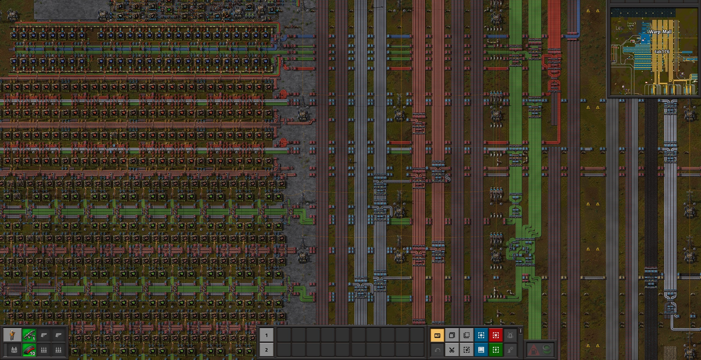

# 生产

> 你的目标是建造“终极”自动工厂，请不要依赖手搓。

本指南主要概述工厂发展的思路，不会太多地涉及太具体的布局方式，这些内容由您自行在游玩过程中进行探索比较有趣。

## 小作坊

游戏一般从会经历小作坊阶段，前期利用小作坊，解锁基础的科技如建设机器人并生产一些后，可以进行批量布局，成倍地扩展工厂规模，并转入总线工厂模式。

## 总线工厂

在总线工厂模式下，生产资源会在主要的几条传送带进行传输，在需要的地方进行分流，提供给组装机。由于黄色地下传送带最远跨越4格距离，铁铜煤这样的基础资源一般是4条并行。

<a href="images/bus-factory.png">
点击查看高清原图
</a>

