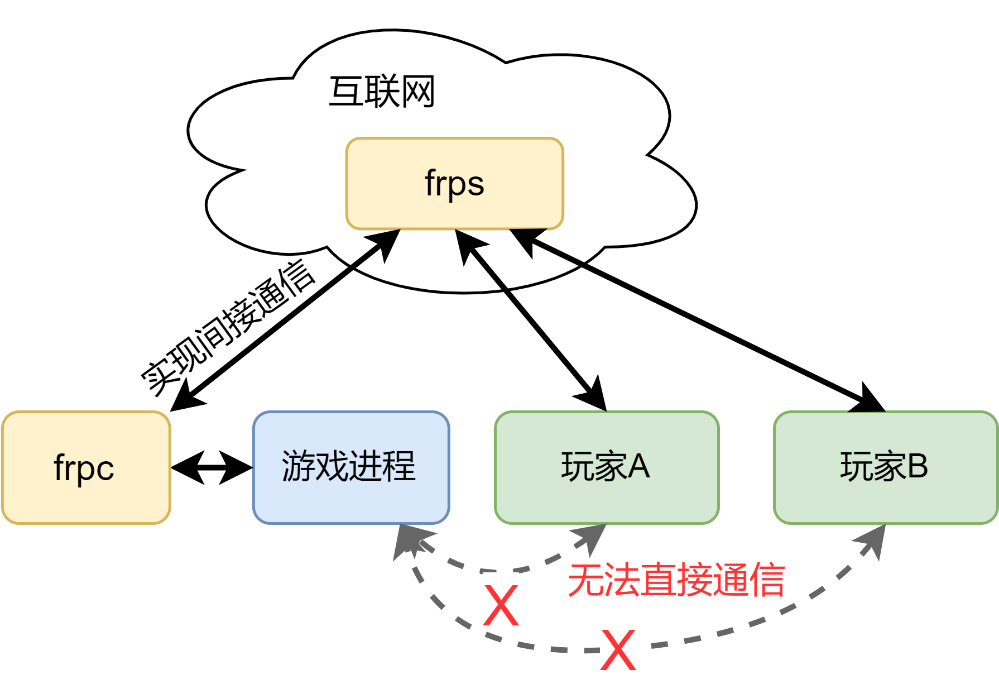

# 开服指南

> <p style="text-align:left;">和好朋友一起冒险才好玩!<span style="float:right;">—— 努努与威朗普</span></p>

在本指南中，我将介绍两种开设服务器的方式，第一种是利用游戏自带的局域网联机功能，另一种是架设专用服务器的方式，游戏作为客户端加入游戏。
由于考虑到玩家一般是使用Windows系统的电脑作为桌面游戏主机，并且专用服务器只能运行在Linux系统上。
这里将开服方式分为 Windows 和 Linux & WSL(Windows Subsystem for Linux) 两种。

也可以根据您个人的预期目标：

- 如果只是约着时间一起玩，不存在单独游玩的情况，可以考虑在Windows系统上依靠游戏自带的联机进行游玩。→ [Windows 系统开服指南](windows.md)
- 如果您有计划7x24小时开设服务器，即使自己没有进游戏，小伙伴也可以加入您的游戏存档，可以考虑通过架设在Linux服务器的方式进行游玩。→ [Linux 专用服务器开服指南](linux.md)


## 内网穿透

*如果您的主机或服务器本身具备公网IP，可以忽略本节内容。*

> 游戏的默认局域网连接端口为34197，使用UDP通讯协议。


这里以frp为例，简要介绍内网穿透的原理和方法。

<center>
    
</center>

1. 准备一台具有公网ip的服务器（可以在腾讯云、阿里云等云服务器商获取）。
2. 在 [github release](https://github.com/fatedier/frp/releases) 页面获取对应的frp软件。
    其软件包的命名方式为 `frp_版本号_系统_CPU架构.zip`，请根据具体的使用情况进行选择。
    Windows 用户一般选择 `*_windows_amd64.zip`，Linux 用户一般选择 `*_linux_amd64.tar.gz` 或 `*_linux_arm.tar.gz`。
3. 在服务器端（具备公网ip的机器）配置 `frps.ini`， 并在命令行执行 `frps -c frps.ini`。
4. 在客户端（运行游戏存档的机器）配置 `frpc.ini`，并在命令行执行 `frpc -c frpc.ini`。


示例配置文件如下，其中`PUBLIC_IP_ADDRESS`需要替换成服务器的公网IP地址，`BIND_PORT`需要替换成 1001-65535 的整数数字，`TOKEN_STRING` 替换成任何字符串，作为frp服务的明文密码：
玩家选择多人游戏→服务器直连→输入地址`PUBLIC_IP_ADDRESS`。

```ini
# frps.ini
[common]
bind_port = BIND_PORT
authentication_method = token
token = TOKEN_STRING
```

```ini 
# frpc.ini
[common]
server_addr = PUBLIC_IP_ADDRESS
server_port = BIND_PORT
token = TOKEN_STRING

[factorio-udp]
type = udp
local_ip = 127.0.0.1
local_port = 34197
remote_port = 34197
```
